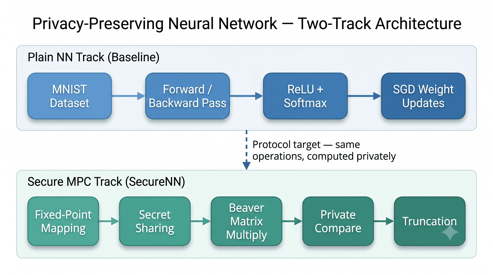

# Privacy-Preserving Neural Networks (PPNN)

Capstone project on **privacy-preserving machine learning** for neural network training in a **three-party secure computation (3PC)** setting — combining a from-scratch neural network with cryptographic building blocks from [SecureNN](https://eprint.iacr.org/2018/442) and [SecureML](https://ieeexplore.ieee.org/document/7958569).

**Author:** Kuber Shahi · Ashoka University · December 2021  
**Advisors:** Dr. Mahavir Jhawar, Dr. Debayan Gupta

---

## Capstone deliverables

The main outputs of this project are the written report and presentation. The code in this repo supports and demonstrates the work described in those documents.

| Resource | Description |
|----------|-------------|
| 📄 [Capstone Report](docs/Capstone_Report.pdf) | Full 32-page write-up: ML preliminaries, SecureNN protocol analysis, and the privacy-preserving NN (PPNN) architecture |
| 📊 [Capstone Presentation](docs/Capstone_Presentation.pdf) | Slide deck summarizing motivation, methods, and results |

**Supporting materials**
- [Research notes](docs/notes/) — derivations for ReLU, Softmax, Private Compare, DReLU, Division, and related protocols
- [Keras reference notebook](notebooks/neural-network-softmax-logistic.ipynb) — same architecture implemented in Python for validation

---

## Overview

Modern ML systems need large datasets, but those datasets are often too sensitive to share directly. This project studies how neural networks can be trained using **secure multi-party computation (MPC)** so that parties can collaborate without revealing raw data.

The work has two complementary tracks:

1. **Plain neural network** — A C++ baseline (ReLU + Softmax, backprop on MNIST) to understand the math and derive update rules.
2. **SecureNN building blocks** — Implementations of the MPC primitives needed to run the same network in a privacy-preserving way.



---

## Implementation

This repository contains the C++ code referenced in the capstone report.

### Plain neural network (`build/nn`)
- 2-layer fully connected network: **784 → 256 → 10**
- **ReLU** (hidden) and **Softmax** (output)
- Cross-entropy loss with mini-batch SGD on MNIST (60k train / 10k test)

### SecureNN building blocks (`build/bb`)
Interactive CLI demos of individual protocols:
- Fixed-point **mapping** and reverse mapping (SecureML-style)
- **Truncation** after ring arithmetic
- **Additive secret sharing** in ℤ<sub>L</sub> and ℤ<sub>p</sub>
- **Secure matrix multiplication** via Beaver triples
- **Private Compare** (unshared and shared settings)

---

## Project structure

```
ppnn-capstone/
├── docs/
│   ├── Capstone_Report.pdf          # primary deliverable
│   ├── Capstone_Presentation.pdf    # primary deliverable
│   ├── assets/                      # diagrams for README
│   └── notes/                       # protocol derivations
├── src/                             # C++ implementation
├── archive/                         # early development scratch (not built)
├── notebooks/                       # Python/Keras reference
├── datasets/mnist.zip
├── scripts/setup-dataset.sh
├── Makefile
└── README.md
```

---

## Quick start

```bash
git clone https://github.com/kubershahi/ppnn-capstone.git
cd ppnn-capstone

chmod +x scripts/setup-dataset.sh
./scripts/setup-dataset.sh

make
./build/nn    # train plain NN on MNIST
./build/bb    # demo SecureNN building blocks
```

**Requirements:** C++11 compiler, [Eigen3](https://eigen.tuxfamily.org/), `make`, `unzip`

```bash
# macOS
brew install eigen

# Ubuntu / Debian
sudo apt-get install libeigen3-dev
```

If the build can't find Eigen, pass the include path explicitly:

```bash
make EIGEN_INCLUDE=-I/usr/include/eigen3
```

---

## References

- Mohassel & Zhang, [*SecureML*](https://ieeexplore.ieee.org/document/7958569)
- Wagh et al., [*SecureNN*](https://eprint.iacr.org/2018/442)
- Goodfellow, Bengio & Courville, [*Deep Learning*](https://www.deeplearningbook.org/)

---

## License

This project is licensed under the [MIT License](LICENSE).

The capstone report and presentation are academic work from Ashoka University (2021). If you use or build on this project, please cite the report and credit the original authors.
